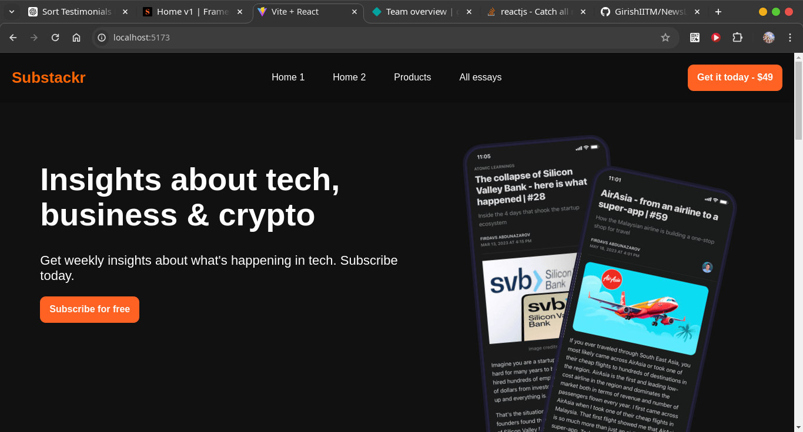
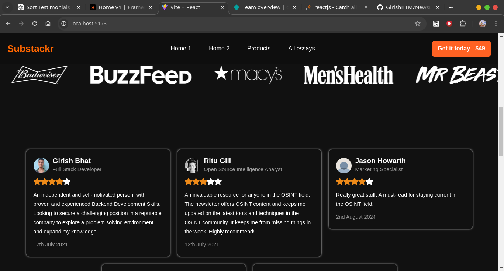

<!-- add images from public/scrn_shot1.png and scrn_shot2.png to test the app run npm run dev
any changes merged into master will be redeployed
 -->

# News Letter App

This is a simple news letter app that allows users to subscribe to a news letter. The app is built with Reactjs

screenshots of the app





# To run the app

- Clone the repo
```bash
  git clone https://github.com/GirishIITM/NewsLetter
```
- move into the directory

```bash
  cd NewsLetter
```

- install dependecies

```bash
  npm install
```

- To run the app
```bash
  npm run dev
```

# To redploy the app

any changes merged into master will be redeployed

deployed link : [NewsLetter](https://master--newslettertestapp.netlify.app//)

```

other links 

https://osintambition.substack.com/
https://app.senja.io/studio
https://osintambition.substack.com/
